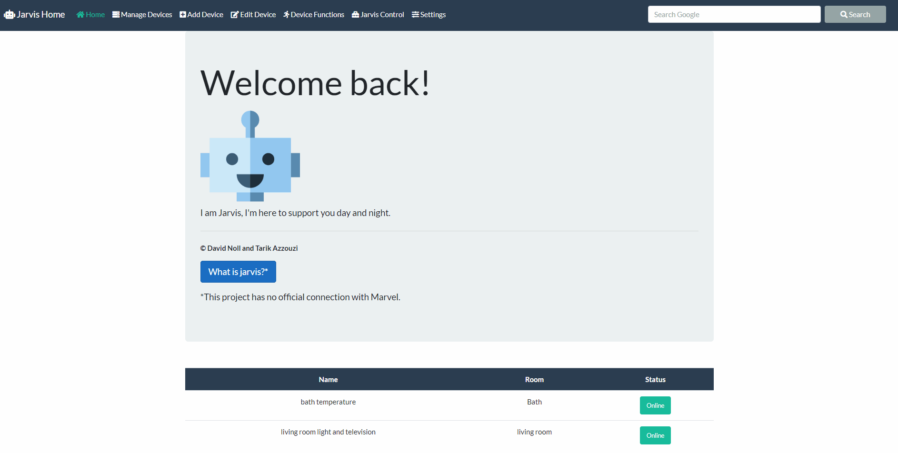

# Jarvis Home
Easily Manage your smart home with Jarvis Home

## Table of Contents
  - [Preview](#preview)
  - [Stats](#stats)
  - [Clone](#clone)
  - [License](#License)
## Preview


## Stats

## Clone
> You can run the server with IIS
> You need python 3 or higher for the GPIO Client
- Enter the following command
```shell
$ git clone https://github.com/CodingTarik/Jarvis-Home.git
```
## License

 
